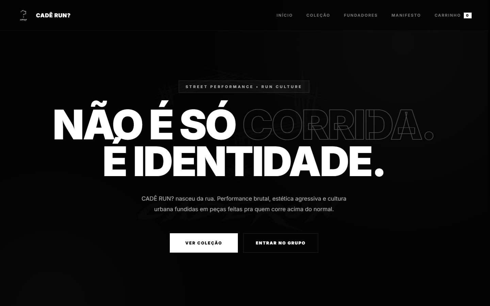
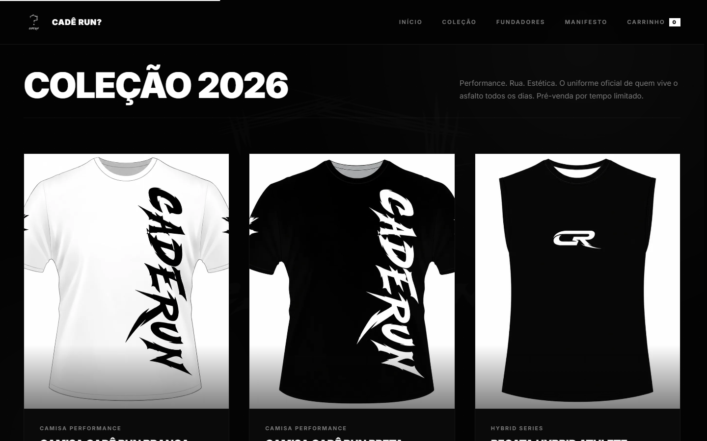
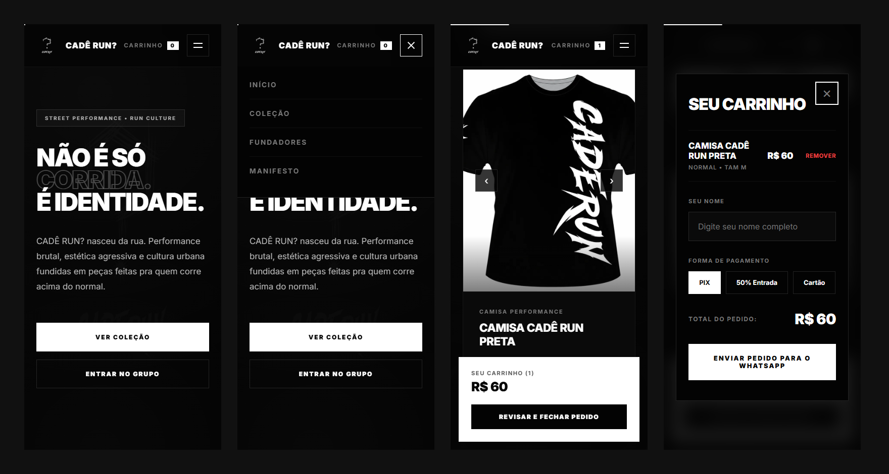

# CADÊ RUN?

Site da CADÊ RUN?, grupo de corrida de rua que virou marca de roupa. Mostra a coleção 2026, os cinco fundadores e o manifesto, e as vendas são feitas pelo próprio site: o cliente monta o carrinho e o pedido chega pronto no WhatsApp da loja.



## Funcionalidades

- Galeria com frente e costas de cada peça (setas no desktop, swipe no celular)
- Escolha de modelagem (Normal ou Baby Look) e tamanho, do PP ao EXGG
- Carrinho com várias peças, salvo no navegador
- Pagamento em PIX, cartão ou 50% de entrada, com o valor de cada parte calculado na hora
- Pedido enviado para o WhatsApp com a mensagem já formatada
- Animações com GSAP e ScrollTrigger, desligadas para quem usa "reduzir movimento"
- Modal navegável pelo teclado (foco preso no modal, `Esc` fecha)





## Tecnologias

HTML, CSS e JavaScript, sem framework e sem build. O GSAP vem por CDN e a fonte (Inter) pelo Google Fonts.

## Rodando

Abra o `index.html` no navegador. Se preferir servir por HTTP:

```bash
npx serve .
```

Antes de publicar, troque o `og:image` do `index.html` por uma URL absoluta. Tem um comentário no `<head>` explicando.

## Estrutura

```
index.html
css/style.css
js/main.js
assets/            logos, favicon e imagem de compartilhamento
assets/produtos/   fotos das peças (frente e costas)
```

## Alterando o site

- O número que recebe os pedidos fica em `WHATSAPP_NUMBER`, no topo de `js/main.js`.
- Para adicionar uma peça, duplique um `<article class="card">` no `index.html` e troque imagens, nome e `data-price` do botão. Peças sem opção de modelagem (como a regata) levam o atributo `data-single-fit` no botão "Comprar".

## Autor

Anderson Ferreira ([@anderson.fsfs](https://www.instagram.com/anderson.fsfs/)), um dos fundadores da CADÊ RUN?.

A marca CADÊ RUN?, o logo e as artes das peças pertencem à [@caderunclub](https://www.instagram.com/caderunclub/) e não podem ser reutilizados sem autorização.
