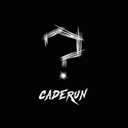

<p align="center">
  
</p>

<h1 align="center">CADÊ RUN?</h1>

<p align="center">
  Site oficial da CADÊ RUN?, movimento de corrida urbana e marca de roupas de performance.<br>
  Catálogo, carrinho e pedido direto pelo WhatsApp, sem backend e sem build.
</p>

<p align="center"><strong>Demo:</strong> <em>em breve</em></p>

<p align="center">
  
</p>

## Sobre

A CADÊ RUN? nasceu da rua: um grupo de corrida que virou marca. O site apresenta a coleção 2026 (camisas e regata), os cinco fundadores e o manifesto do movimento. As vendas são feitas pelo próprio site: o cliente monta o carrinho e o pedido chega formatado no WhatsApp da loja.

## Funcionalidades

- Catálogo com galeria de frente e costas de cada peça (setas no desktop, swipe no celular)
- Escolha de modelagem (Normal ou Baby Look) e tamanho, do PP ao EXGG
- Carrinho com várias peças, total atualizado em tempo real e remoção de itens (salvo no navegador, não se perde ao recarregar a página)
- Três formas de pagamento: PIX, cartão ou 50% de entrada, com o valor de cada parcela calculado na hora
- Validação de nome completo antes de enviar o pedido
- Pedido enviado para o WhatsApp com uma mensagem pronta e organizada
- Animações de entrada e parallax com GSAP e ScrollTrigger
- Layout responsivo, do celular ao monitor ultrawide, com menu próprio para telas pequenas

<p align="center">
  
</p>

<p align="center">
  
</p>

## Detalhes técnicos

- **Sem dependências de build.** HTML, CSS e JavaScript puros. Basta abrir o `index.html`.
- **Leve.** As fotos das peças estão em WebP e somam cerca de 160 KB.
- **Acessível.** Dá pra comprar só com o teclado: o foco fica preso no modal enquanto ele está aberto, `Esc` fecha o modal e o menu do celular, os botões têm rótulos para leitores de tela e as animações são desligadas para quem ativa "reduzir movimento" no sistema.
- **Pronto pra compartilhar.** Tem metatags Open Graph, então o link gera uma prévia com imagem no WhatsApp e no Instagram.

## Tecnologias

- HTML5 semântico
- CSS3 (custom properties, grid, flexbox, media queries)
- JavaScript (ES2020+, sem frameworks)
- [GSAP 3](https://gsap.com/) + ScrollTrigger, via CDN
- Fonte [Inter](https://fonts.google.com/specimen/Inter), via Google Fonts

## Estrutura

```
.
├── index.html
├── css/
│   └── style.css
├── js/
│   └── main.js
└── assets/
    ├── logo-nav.png        # logo do cabeçalho (tamanho reduzido)
    ├── logo-watermark.webp # logo da marca d'água do fundo
    ├── favicon.png
    ├── apple-touch-icon.png
    ├── og-image.jpg
    └── produtos/          # fotos das peças (frente e costas)
```

## Rodando localmente

Não precisa instalar nada: abra o `index.html` direto no navegador.

Se preferir servir por HTTP, rode na pasta do projeto:

```bash
npx serve .
```

## Personalizando

- **Número que recebe os pedidos:** altere `WHATSAPP_NUMBER` no topo de `js/main.js`.
- **Nova peça:** duplique um bloco `<article class="card">` no `index.html` e troque as imagens, o nome e o `data-price` do botão. Para peças sem opção de modelagem (como a regata), adicione o atributo `data-single-fit` no botão "Comprar".

## Publicando no GitHub Pages

1. Suba o projeto para um repositório no GitHub.
2. Vá em **Settings → Pages**.
3. Em **Source**, escolha **Deploy from a branch**, selecione a branch `main` e a pasta `/ (root)`.
4. Em alguns minutos o GitHub mostra o endereço do site publicado nessa mesma página.
5. Com o endereço em mãos, troque o `og:image` do `index.html` por uma URL absoluta (há um comentário explicando logo acima das metatags).

## Autor

Desenvolvido por **Anderson** ([@anderson.fsfs](https://www.instagram.com/anderson.fsfs/)), um dos fundadores da CADÊ RUN?.

Siga a marca: [@caderunclub](https://www.instagram.com/caderunclub/)

---

A marca CADÊ RUN?, o logo e as artes das peças pertencem à CADÊ RUN? e não podem ser reutilizados sem autorização.
